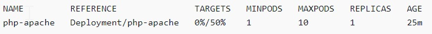

# Autoscaling #

Autoscaling is a function that automatically scales the resources up or down to meet changing demands. This is a major Kubernetes function that would otherwise require extensive human resources to perform manually.  

### Benefits of Autoscaling ###
To understand better where autoscaling would provide the most value, 
Imagine you have a 24/7 production service with a load that is variable in time, where it is very busy during the day, and relatively low at night. Ideally, 
we would want the number of nodes in the cluster and the number of pods in deployment to dynamically adjust to the load to meet end user demand. 
The new Cluster Autoscaling feature together with Horizontal Pod Autoscaler can handle this for you automatically.

### Horizontal Pod Autoscaling ###
In Kubernetes, a HorizontalPodAutoscaler automatically updates a workload resource (such as a Deployment or StatefulSet), with the aim of automatically scaling the workload to match demand.
Horizontal scaling means that the response to increased load is to deploy more Pods. This is different from vertical scaling, which for Kubernetes would mean assigning more resources (for example: memory or CPU) to the Pods that are already running for the workload.  

If the load decreases, and the number of Pods is above the configured minimum, the HorizontalPodAutoscaler instructs the workload resource (the Deployment, StatefulSet, or other similar resource) to scale back down.  

The HorizontalPodAutoscaler is implemented as a Kubernetes API resource and a controller. The resource determines the behavior of the controller. The horizontal pod autoscaling controller, running within the Kubernetes control plane, periodically adjusts the desired scale of its target (for example, a Deployment) to match observed metrics such as average CPU utilization, average memory utilization, or any other custom metric you specify.  

### Run a Horizontal Pod Autoscaler test application ###
In this section, you deploy a sample application to verify that the Horizontal Pod Autoscaler is working.  

### To test Horizontal Pod Autoscaler installation ###

### #1 Deploy a simple Apache web server application with the following command.###

$kubectl apply -f https://k8s.io/examples/application/php-apache.yaml    
This Apache web server pod is given a 500 millicpu CPU limit and it is serving on port 80.  

### #2 Create a Horizontal Pod Autoscaler resource for the php-apache deployment.###

$kubectl autoscale deployment php-apache --cpu-percent=50 --min=1 --max=10    
This command creates an autoscaler that targets 50 percent CPU utilization for the deployment, with a minimum of one pod and a maximum of ten pods. When the average CPU load is below 50 percent, 
the autoscaler tries to reduce the number of pods in the deployment, to a minimum of one. When the load is greater than 50 percent, the autoscaler tries to increase the number of pods in the deployment, up to a maximum of ten.   

### #3 Describe the autoscaler with the following command to view its details.###

$kubectl get hpa  
The example output is as follows.

As you can see, the current CPU load is 0%, because there's no load on the server yet. The pod count is already at its lowest boundary (one), so it cannot scale in.

### #4 Create a load for the web server by running a container.###
kubectl run -i \  
    --tty load-generator \  
    --rm --image=busybox \  
    --restart=Never \  
    -- /bin/sh -c "while sleep 0.01; do wget -q -O- http://php-apache; done"  

### #5 To watch the deployment scale out, periodically run the following command in a separate terminal from the terminal that you ran the previous step in.###

kubectl get hpa php-apache  

  

It may take over a minute for the replica count to increase. As long as actual CPU percentage is higher than the target percentage, then the replica count increases, up to 10. In this case, it's 250%, so the number of REPLICAS continues to increase.  

### #6 Stop the load. In the terminal window you're generating the load in, stop the load by holding down the Ctrl+C keys. You can watch the replicas scale back to 1 by running the following command again in the terminal that you're watching the scaling in.###
kubectl get hpa  
  

